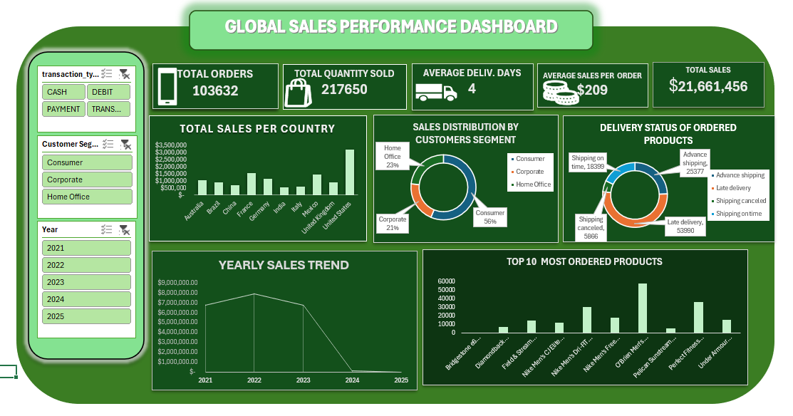
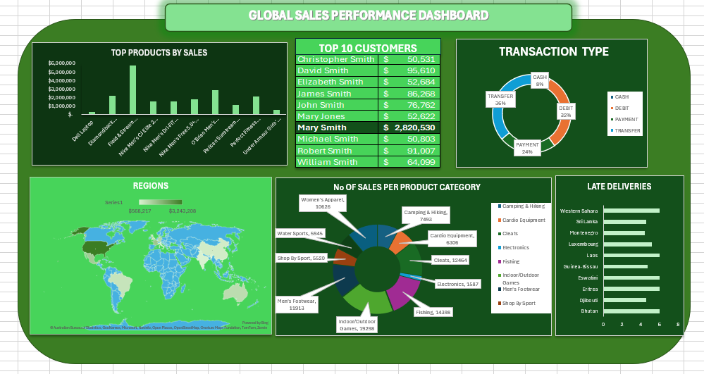

# global-sales-performance-analysis
Analysis of global sales performance across customers, products, regions, transactions, and delivery operations,

# Global Sales Performance Analysis

## Project Overview

This project analyzes global sales performance across customers, products, regions, transaction methods, and delivery operations. The dashboard provides an overview of key sales metrics and explores the factors contributing to overall business performance.

## Business Question

How is the company performing across sales, products, customers, regions, and delivery operations, and which areas are driving overall business performance?

## Tools Used

- Microsoft Excel
- Pivot Tables
- Pivot Charts
- Excel Slicers

## Dashboard

## Key Insights

- The business generated approximately **$21.66 million in total sales** from **103,632 orders**, with an average sales value of about **$209 per order**.

- The **Consumer segment** accounted for the largest share of sales at approximately **56%**, making it the strongest customer segment compared with Corporate and Home Office customers.

- Delivery performance presents a major operational concern. **Late deliveries accounted for 53,990 orders**, considerably higher than orders shipped on time or in advance.

- **Transfers and debit transactions** were the most commonly used payment methods, accounting for approximately **36% and 32%** of transactions respectively.

- Sales performance varied across products and customers, with a relatively small group of top-performing products and customers contributing substantially to overall revenue.

- The yearly sales trend shows a significant decline toward **2024 and 2025**. However, this last year didn't have a complete dataset.
